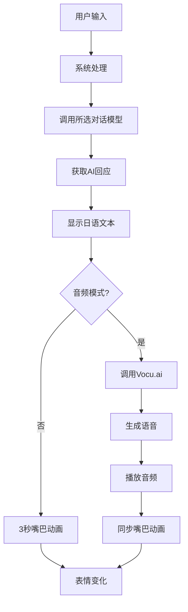

# AMDS-RE (Amadeus) 项目说明（20260215写，后续更新我懒得在这里补了，直接写在release）
未来装置研究所最新力作，爱来自Kurio
b站： https://b23.tv/24zTirI


## 项目来源

这个项目的灵感来源于《命运石之门》中的 Amadeus 系统 —— 那个可以和牧濑红莉栖的ai对话的系统。

原版的Amadeus手机软件早就已经不能用了，而且说实话，那个版本根本谈不上智能。而且正如我所说，我不是个计算机领域的专家，网上其他大佬搓出来的手工amadeus效果很好但是太复杂我操作不明白，于是我就自己搓了一个简化版（笑）

**说明**：
- 所有表情和预设音频都是从原版Amadeus手机软件中解包提取的（预设音频出现的概率我设置为30%，其余由ai现场生成（如果你足够有耐心））
- 保留了原版的视觉和听觉体验
- 但核心AI和语音生成完全重新实现，更加智能

**使用方法**
去火山引擎注册账号，免费申请一个豆包2.0 mini可用的api，然后去： https://www.vocu.studio 
注册一个账号，在assests/audio文件夹挑一个时间稍长的语音复刻一个克里斯蒂娜音频复制角色id，然后申请一个api，到软件设置中填入即可

我复刻的克里斯蒂娜音频还在审核中，审核完后你们应该可以直接套用我的结果


## 实现功能

### 🎭 角色系统
- **丰富的表情**：克里斯蒂娜有各种预设表情（开心、生气、害羞、惊讶等）
  - 音频模式：自然日语句子一结束就开始 Vocu 合成，长回复会继续分成第 3、4 段并顺序播放；播放时嘴部动画会自动同步
  - 文本模式：显示日文文本时也会有3秒的张嘴动画，但是没有声音（除非触发了预设音频）。不过此时的速度相当快，延迟在一秒内


### 💬 对话系统
- **AI对话**：支持 OpenAI Responses API、火山方舟豆包、DeepSeek 和本地 Ollama
- **多轮对话**：近期原文+滚动摘要的分层记忆，不再因固定消息数要求重启
- **重要事实**：用户明确要求记住的信息会立即保存，稳定偏好、目标等可在回复后后台提取
- **日语显示**：左下角显示日语原文，右侧聊天框是中文


### ⚙️ 配置系统
- **API密钥管理**：首次运行时输入，后续自动保存到本地
- **Responses API**：可配置 Base URL、密钥和模型名，支持强制流式的 Responses 端点
- **音频模式切换**：可以开启/关闭语音模式
- **tokens管理**：用于调用豆包API输出的文本大小，会影响到对话的长度、速度、完整性以及音频生成的时间


### 📦 打包系统
- **oneDir**：写了个py脚本，应该可以一键打包为exe文件，
## 工作原理

### 整体流程



### 详细说明


#### 1. AI对话生成
系统可使用 **OpenAI Responses API、豆包、DeepSeek 或 Ollama** 作为语言模型：
- 统一的角色 skill 会把用户消息和分层记忆发给当前选中的提供商
- 模型会生成红莉栖风格的回应
- 回应内容会以日语形式返回

#### 2. 文本显示
AI生成的日语文本会显示在红莉栖下方的文本框中：

#### 3. 语音生成与播放
如果开启了音频模式，系统会：
- 将AI生成的日语文本发送给**Vocu.ai**
- Vocu.ai会生成对应的日语语音
- 使用QMediaPlayer播放生成的语音
- 默认优先获取 Vocu `streamUrl`，第一句短日语闭合后立即开始 TTS，不等完整日语和中文全部输出
- 中文在双语分隔符出现后按模型增量立即显示，不再等待完整回复或额外打字机延时
- 多段日语采用最多两个实时请求并行生成；播放当前段时会预连接下一段并解码首帧，上一段结束后直接放行播放
- 播放端复用流连接并使用小块读取，仍严格保持原句顺序
- 专用流播放器失败时会直接回退到 Qt 网络播放，不在界面线程同步下载完整文件
- 我不知道为什么网页版生成速度很快，但是我这里调用api就是很慢，我服了


#### 4. 分层永久记忆
开启永久记忆后，数据保存在 `%LOCALAPPDATA%\AMDS`：
- `conversation_history.json`：完整本地聊天记录
- `memory_state.json`：早期对话的滚动摘要状态
- `memory_facts.json`：姓名、生日、长期偏好、目标、关系和用户要求记住的重要事实

可以直接说“请记住我叫小明”“不要忘记我喜欢胡椒博士”；需要删除时说“忘掉胡椒博士”。
设置中的“管理重要记忆…”可以查看、修改、添加或删除事实。自动事实提取在回复显示后后台运行，不阻塞当前回复。

#### 5. 表情变化
根据对话内容，红莉栖会切换不同的表情：
- 系统会分析AI回应的情绪
- 从预设的表情库中选择对应的表情
- 随机选择该情绪下的一个表情变体（比如happy1、happy2、happy3）

### 技术栈

- **前端框架**：PyQt6（用于构建图形界面）
- **编程语言**：Python 3.13
- **音频播放**：QMediaPlayer + QAudioOutput + miniaudio 低延迟流播放
- **配置管理**：QSettings（Qt原生配置系统）
- **语言模型**：OpenAI Responses API / 豆包 / DeepSeek / Ollama
- **语音生成**：Vocu.studio
- **图像处理**：Pillow（用于图标转换）
- **打包工具**：PyInstaller

## 项目结构

```
AMDS-RE/
├── src/
│   ├── main.py              # 程序入口
│   ├── ui/                  # PyQt界面组件
│   │   ├── main_window.py       # 主窗口和设置应用逻辑
│   │   ├── chat_widget.py       # 聊天界面和音频播放协调
│   │   ├── character.py         # 角色立绘、字幕和嘴部动画
│   │   ├── settings_dialog.py   # 设置窗口
│   │   ├── memory_facts_dialog.py # 重要记忆管理窗口
│   │   ├── splash_screen.py     # 启动画面
│   │   └── debug_window.py      # 调试日志窗口
│   ├── services/            # AI、语音和后台任务
│   │   ├── ai_manager.py        # AI对话、翻译和记忆保存
│   │   ├── conversation_memory.py # 完整历史、摘要和重要事实
│   │   ├── workers.py           # Qt后台线程
│   │   ├── voice_dialog.py      # 预设语音匹配和表情映射
│   │   ├── audiogenerate.py     # Vocu语音生成
│   │   └── audio_player.py      # 本地音频与低延迟网络流播放
│   ├── core/                # 核心配置与解析
│   │   ├── resources.py         # 资源和配置路径
│   │   ├── app_config.py        # 默认模型和设置常量
│   │   ├── model_config.py      # 本地开发模型配置导入
│   │   ├── character_skill.py   # 角色skill加载和提示词生成
│   │   └── reply_parser.py      # 双语回复解析和历史清洗
│   └── utils/               # 通用工具
│       ├── debug_log.py         # 运行日志缓冲
│       ├── image_utils.py       # 图片压缩和编码
│       └── thread_pool.py       # 共享线程池
├── assets/
│   ├── audio/           # 音频文件（原版解包提取）
│   ├── prompts/         # 项目角色skill和提示词配置
│   └── images/          # 图像文件（原版解包提取）
│       ├── ic_launcher.png  # 应用图标
│       ├── logo39.ico       # 备用图标
│       └── kurisu_*.png     # 角色表情
├── build.bat           # 打包脚本
└── dist/
    └── AMDS.exe        # 打包结果
```

## 使用方法

### 首次运行

1. 双击 `AMDS.exe`
2. 输入你的豆包API密钥
3. 输入你的Vocu.studio API密钥
4. 选择是否开启音频模式
5. 开始与红莉栖对话！

### 开发运行

```powershell
pip install -r requirements.txt
python src/main.py
```

开发环境可在项目根目录放置 `模型.txt`。程序会将新内容一次性导入本地设置。
该文件已被 Git 忽略，不会进入源码仓库或发行包；不要将密钥提交到 Git。

### 日常使用

1. 在输入框中输入你想对红莉栖说的话
2. 按回车发送
3. 等待红莉栖的回应

### 配置说明

- **豆包API**：用于生成AI对话内容
- **Vocu API**：用于生成日语语音
- **音频模式**：可以随时开启或关闭语音功能
- **预设音频概率**：可以在设置中调整触发原版预设语音的概率
- **永久记忆**：完整历史保存在本地；模型接收重要事实、滚动摘要和近期原文
- **重要记忆管理**：在设置中查看、添加、修改、删除事实，或在聊天中使用“请记住…”和“忘掉…”
- **Vocu生成方式**：推荐开启“实时流优先”；异步任务是独立的备选开关，可能需要 Vocu 会员权限
- **默认模型**：默认使用豆包 2.0 mini，已移除旧的豆包 1.6 lite 选项

## 未来计划

- [ ] 实现语音输入
- [ ] 添加更多表情和动作.我不是个绘画领域的专家，所以我会尝试使用ai生图
- [ ] 优化AI对话质量，目前的提示词我其实没有完全满意
- [x] 添加分层永久记忆和可管理的重要事实表
- [x] 接入新的 Responses 对话模型和 Vocu 音色配置
- [x] 优化音频生成、预热、实时流和播放回退链路

## 结语


这个项目虽然不大，但包含了我挺多心血。虽然原版的Amadeus已经不能用了，但我希望这个复刻版本能给你带来一点快乐，我已经尽我所能简化了这个系统的操作难度，比起各种平台混合搭建调用，这个用pyqt6构建+两个api调用的版本应该会极大降低使用门槛。如果你想直接操作代码，可以从 `src/main.py` 看入口，再按功能去对应模块里改。

如果有任何问题或建议，欢迎告诉我！

---


*El Psy Kongroo*
