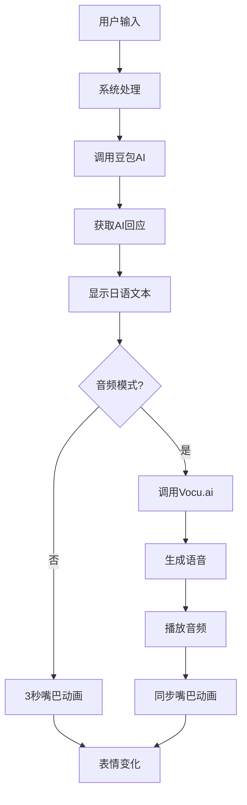

# AMDS-RE (Amadeus) 项目说明
未来装置研究所最新力作，爱来自Kurio
b站： https://b23.tv/24zTirI


## 项目来源

这个项目的灵感来源于《命运石之门》中的 Amadeus 系统 —— 那个可以和牧濑红莉栖的ai对话的系统。

原版的Amadeus手机软件早就已经不能用了，而且说实话，那个版本根本谈不上智能。而且正如我所说，我不是个计算机领域的专家，网上其他大佬搓出来的手工amadeus效果很好但是太复杂我操作不明白，于是我就自己搓了一个简化版（笑）

**说明**：
- 所有表情和预设音频都是从原版Amadeus手机软件中解包提取的（预设音频出现的概率我设置为30%，其余由ai现场生成（如果你足够有耐心））
- 保留了原版的视觉和听觉体验
- 但核心AI和语音生成完全重新实现，更加智能

**使用方法**
去火山引擎注册账号，免费申请一个豆包1.6lite的api，然后去： https://www.vocu.studio 
注册一个账号，在assests/audio文件夹挑一个时间稍长的语音复刻一个克里斯蒂娜音频复制角色id，然后申请一个api，到软件设置中填入即可

我复刻的克里斯蒂娜音频还在审核中，审核完后你们应该可以直接套用我的结果


## 实现功能

### 🎭 角色系统
- **丰富的表情**：克里斯蒂娜有各种预设表情（开心、生气、害羞、惊讶等）
  - 音频模式：由于语音生成需要时间，大致会有3-20秒延迟，需要耐心等待。关于这个延迟问题我没明白，流式传输和flash模式都启用了但是还是存在，我在想可能是因为我用的是免费版的vocu.ai所以延迟会高一些，等我有时间再研究一下。音频播放的时候嘴会动
  - 文本模式：显示日文文本时也会有3秒的张嘴动画，但是没有声音（除非触发了预设音频）。不过此时的速度相当快，延迟在一秒内


### 💬 对话系统
- **AI对话**：集成豆包1.6 Lite，实现智能对话
- **多轮对话**：支持连续对话（极限是200条，也就是100轮对话），表情会随对话变化
- **日语显示**：左下角显示日语原文，右侧聊天框是中文


### ⚙️ 配置系统
- **API密钥管理**：首次运行时输入，后续自动保存到本地
- **音频模式切换**：可以开启/关闭语音模式
- **tokens管理**：用于调用豆包API输出的文本大小，会影响到对话的长度、速度、完整性以及音频生成的时间


### 📦 打包系统
- **单文件EXE**：写了个py脚本，应该可以一键打包为exe文件，也就是说你可以在修改完代码后直接运行这个脚本，就可以打包出一个新的exe文件
## 工作原理

### 整体流程



### 详细说明


#### 1. AI对话生成
系统使用**豆包1.6 Lite**作为语言模型：
- 本质上这就是个简单的提示词工程，将你的消息发送给修改过的豆包API
- 豆包哥会分析你的输入，生成红莉栖风格的回应
- 回应内容会以日语形式返回

#### 2. 文本显示
AI生成的日语文本会显示在红莉栖下方的文本框中：

#### 3. 语音生成与播放
如果开启了音频模式，系统会：
- 将AI生成的日语文本发送给**Vocu.ai**
- Vocu.ai会生成对应的日语语音
- 使用QMediaPlayer播放生成的语音
- 我不知道为什么网页版生成速度很快，但是我这里调用api就是很慢，我服了


#### 4. 表情变化
根据对话内容，红莉栖会切换不同的表情：
- 系统会分析AI回应的情绪
- 从预设的表情库中选择对应的表情
- 随机选择该情绪下的一个表情变体（比如happy1、happy2、happy3）

### 技术栈

- **前端框架**：PyQt6（用于构建图形界面）
- **编程语言**：Python 3.13
- **音频播放**：QMediaPlayer + QAudioOutput
- **配置管理**：QSettings（Qt原生配置系统）
- **语言模型**：豆包1.6 Lite
- **语音生成**：Vocu.studio
- **图像处理**：Pillow（用于图标转换）
- **打包工具**：PyInstaller

## 项目结构

```
AMDS-RE/
├── src/
│   └── main.py          # 主程序
├── assets/
│   ├── audio/           # 音频文件（原版解包提取）
│   └── images/          # 图像文件（原版解包提取）
│       ├── ic_launcher.png  # 应用图标
│       ├── logo39.ico       # 备用图标
│       └── kurisu_*.png     # 角色表情
├── build.bat           # 打包脚本
└── dist/
    └── AMDS.exe        # 打包结果
```

## 使用方法

### 首次运行

1. 双击 `AMDS.exe`
2. 输入你的豆包API密钥
3. 输入你的Vocu.studio API密钥
4. 选择是否开启音频模式
5. 开始与红莉栖对话！

### 日常使用

1. 在输入框中输入你想对红莉栖说的话
2. 按回车发送
3. 等待红莉栖的回应

### 配置说明

- **豆包API**：用于生成AI对话内容
- **Vocu API**：用于生成日语语音
- **音频模式**：可以随时开启或关闭语音功能

## 未来计划

- [ ] 实现语音输入
- [ ] 添加更多表情和动作.我不是个绘画领域的专家，所以我会尝试使用ai生图
- [ ] 优化AI对话质量，目前的提示词我其实没有完全满意
- [ ] 添加记忆功能，让红莉栖记住上一次软件关闭前的对话，让她在能力限度最更完整的记住你
- [ ] 添加更多的语言模型选项和音频模型选项
- [ ] 我会尝试优化音频的

## 结语


这个项目虽然不大，但包含了我挺多心血。虽然原版的Amadeus已经不能用了，但我希望这个复刻版本能给你带来一点快乐，我已经尽我所能简化了这个系统的操作难度，比起各种平台混合搭建调用，这个用pyqt6构建+两个api调用的版本应该会极大降低使用门槛。如果你想直接操作代码，那么就去src目录下，修改main.py文件吧。

如果有任何问题或建议，欢迎告诉我！

---


*El Psy Kongroo*
